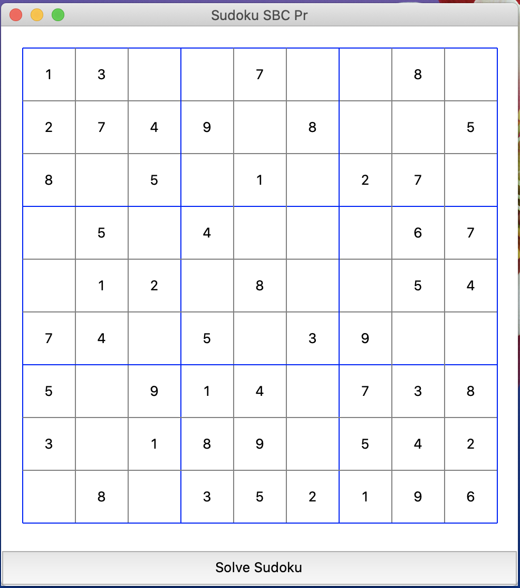

# Sudoku Solver CLP

## Description

This is a project that demonstrates  the usage of clips programming language(CLP) and Python to solve a sudoku board. (sudokuv3.clp)

The python module loads the clp file, run it and then draw the grid, print the numbers and solves the sudoku.

There are 2 ways to see the solution, the first one by clicking the Solve Btn and the second one by clicking on empty cells.


## How to run

```
python gui.py
```


